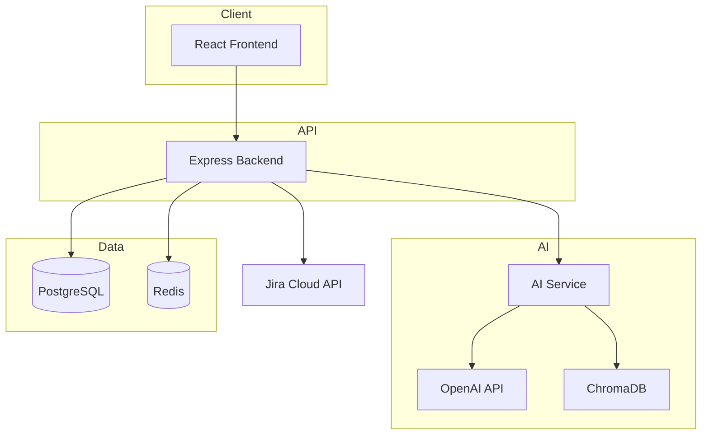

# Architecture — Jira Ticket Intelligence MVP

> Full documentation including GitLab Duo integration issues: **[PROJECT_DOCUMENTATION.md](./PROJECT_DOCUMENTATION.md)**

## System Overview

The platform is a **three-tier monorepo** optimized for fast MVP delivery:

| Layer | Technology | Responsibility |
|-------|------------|----------------|
| Frontend | React, TypeScript, Tailwind, ShadCN-style UI, React Query | Dashboard, ticket views, chat UI |
| Backend | Node.js, Express, PostgreSQL, Redis | Auth, Jira sync, REST APIs, orchestration |
| AI Service | Node.js, OpenAI, ChromaDB, LangChain-compatible RAG | Embeddings, vector search, LLM calls |

## Data Flow

### 1. Jira Sync Pipeline

```
Jira REST API → Backend (jira.service) → PostgreSQL
                                      → AI Service (/embed) → ChromaDB
```

- Fetches resolved issues via JQL
- Parses ADF descriptions, comments, changelog
- Stores structured ticket data + comments
- Generates embeddings for each ticket document

### 2. New Ticket Analysis

```
User opens ticket → Backend → AI analyze + embed
                           → Vector search (similar)
                           → GPT recommendation
                           → Store ai_recommendations
```

### 3. RAG Chat

```
User message → Backend chat.service
            → AI Service ragChat()
            → ChromaDB similarity retrieval (top 5)
            → GPT with grounded context
            → Response + source citations
```

## Component Diagram



## Security

- JWT authentication on all `/api/*` routes except `/auth/login` and `/auth/register`
- Jira API tokens stored in DB (MVP: plain text; production: encrypt with KMS)
- Admin-only routes: Jira config, sync
- CORS restricted to frontend origin

## Scalability Path

| MVP | Production |
|-----|------------|
| Single backend instance | Horizontal scaling behind load balancer |
| ChromaDB single node | Pinecone or managed vector DB |
| Sync on-demand | Webhook from Jira + queue (BullMQ) |
| Redis optional cache | Required for session + rate limits |

## API Gateway Pattern

All frontend calls go to `/api/*` on the backend. The backend proxies AI operations to the AI service — keeping OpenAI keys off the client and allowing independent scaling of the AI layer.
